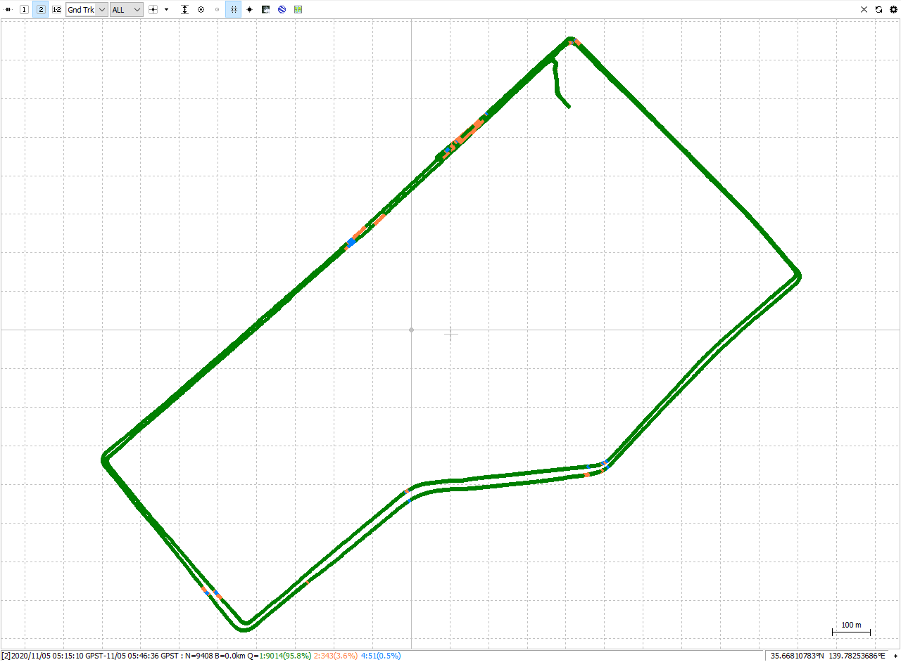

# A tightly coupling program

---

## Reference

"Principles of GNSS, Inertial, and Multisensory Integrated Navigation Systems," Second Edition by Paul Groves;

**https://github.com/benzenemo/TightlyCoupledINSGNSS**;

**https://github.com/dzd9798/READ_GNSS**;

**https://github.com/YizeZhang/Net_Diff**;

**https://github.com/yandld/nav_matlab**;

**https://github.com/Kyle-ak/imu_tk**.

---

## Usage catalog

1_ReadIMU contains some tools about IMU internal parameter calibration and attitude alignment (not finished);

2_ReadGNSS contains a singal point positioning, it can read RINEX 3.02 GNSS raw data, calculate the receiver position, velocity, clock error, clock rate error and other information for tightly coupling;

3_TightlyCoupling contains a GNSS/IMU tightly coupling program using persudo rang and persudo range rate, several Kalman filter methods for choose, now, only support GPS and QZSS.

---

## Data for tightly coupling

Program start from Main.m file;

GNSS data is GNSSTCData_GQ.mat, from "2_ReadGNSS" result;

IMU data is IMUData.mat. Got from Estelle, body frame is R-F-D;

Initial position and velocity is from RTK, receiver clock error and clock rate error is form "2_ReadGNSS" result,

and the attitude is not accurate now.

Data was taken in tsukishima by Tokyo university of marine science and technology.

---

## Mention

There is gross error in clock error calculation, so program can't run fully, you can set break points in "Tightly_coupled_INS_GNSS.m" line 248 and line 270.

---

Hard ware:

Track:

