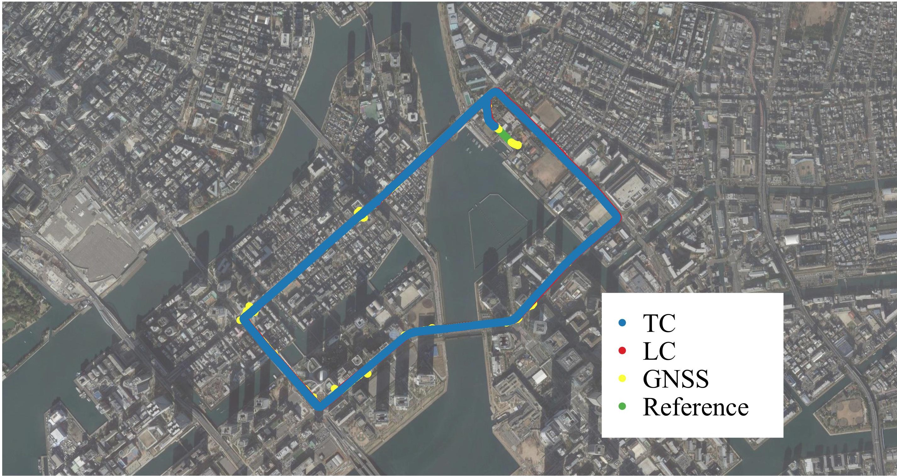

# A tightly coupling program

---

## Reference

"Principles of GNSS, Inertial, and Multisensory Integrated Navigation Systems," Second Edition by Paul Groves;

**https://github.com/benzenemo/TightlyCoupledINSGNSS**;

**https://github.com/dzd9798/READ_GNSS**;

**https://github.com/YizeZhang/Net_Diff**;

**https://github.com/yandld/nav_matlab**;

**https://github.com/Kyle-ak/imu_tk**.

---

## Usage catalog

1_ReadIMU contains some tools about IMU internal parameter calibration and attitude alignment (not finished);

2_ReadGNSS contains a singal point positioning, it can read RINEX 3.02 GNSS raw data, calculate the receiver position, velocity, clock error, clock rate error and other information for tightly coupling (Not include the Ionospheric delay);

3_LooselyCoupling contains a GNSS/IMU loosely coupling program using GNSS position and velocity.

4_TightlyCoupling contains a GNSS/IMU tightly coupling program using persudo rang and persudo range rate, several Kalman filter methods for choose, using GPS/QZSS/GALLO/BDS.

---

## Data for tightly coupling

Program start from Main.m file;

IMU data is IMUData.mat. Got from Estelle, body frame is R-F-D;

Data was taken in tsukishima by Tokyo university of marine science and technology.

---

## Mention

This code is for reference only : )

---

Hard ware:

Track:

Result:

